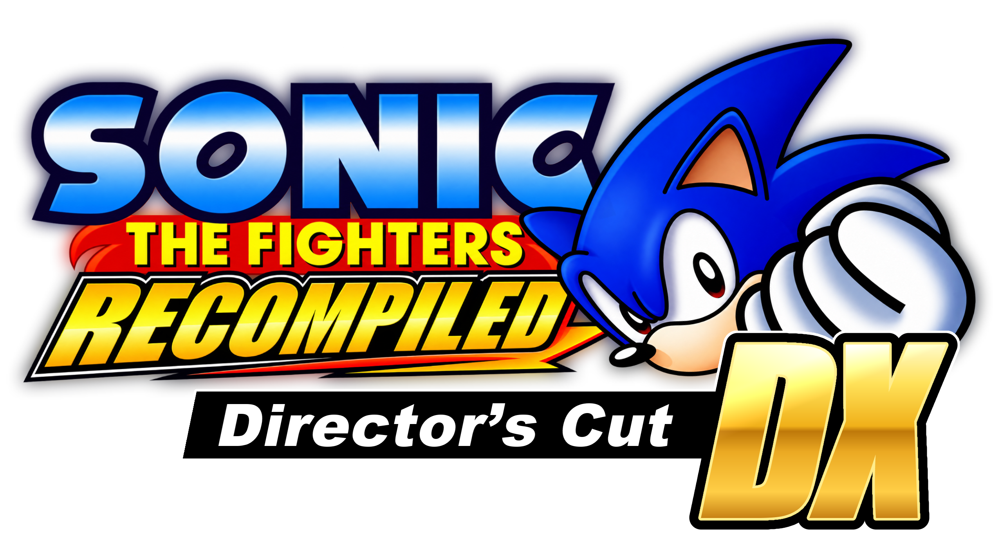

<div align="center">



# Sonic the Fighters Recompiled

Нативная рекомпиляция Xbox 360 XBLA-версии <i>Sonic the Fighters</i> для Windows.

**Текущая версия: v0.1.0**

</div>

---

**Sonic the Fighters Recompiled** — неофициальный нативный порт Xbox 360 XBLA-версии *Sonic the Fighters* для Windows, созданный методом рекомпиляции с использованием стека RexGlue / RexGL.

Проект переносит XBLA-релиз на современные ПК без необходимости эмуляции Xbox 360 или использования Xenia. Он обеспечивает нативный запуск в Windows, настройку разрешения и частоты кадров, поддержку клавиатуры и контроллеров, встроенный установщик, дополнительные настройки, сохранения и другие улучшения, упрощающие установку и запуск игры на современных системах.

> [!IMPORTANT]
> **rexruntime.dll - является false positive и может обнаруживаться антивирусами. Взят файл с оригинального репозитория rexglue-sdk и может быть заменен исходным с их репозитория.**
>

> [!IMPORTANT]
> **Sonic the Fighters Recompiled не распространяет оригинальную игру.**
>
> Вы должны предоставить необходимые игровые данные из собственной легально приобретённой копии *Sonic the Fighters*. Перед установкой установщик проверяет предоставленный файл игры.

## Зачем существует этот проект?

**Sonic the Fighters Recompiled существует, чтобы сохранить XBLA-версию игры и дать ей нативную жизнь на ПК.**

Это версия игры, в которую я сам хотел поиграть много лет. Теперь, когда создание нативной версии для ПК стало возможным, я хочу сохранить её и сделать легко доступной для всех — без возни и лишних накладных расходов, связанных с эмуляцией Xbox 360.

Цель проста: предоставить удобный нативный способ играть в XBLA-версию *Sonic the Fighters* на современном оборудовании.

---

## Содержание

- [Возможности](#возможности)
- [Системные требования](#системные-требования)
- [Установка](#установка)
- [Управление](#управление)
- [Настройки графики и рекомпиляции](#настройки-графики-и-рекомпиляции)
- [Сохранения](#сохранения)
- [Известные проблемы](#известные-проблемы)
- [Планы](#планы)
- [Технические подробности](#технические-подробности)
- [FAQ](#faq)
- [Благодарности](#благодарности)
- [Отказ от ответственности](#отказ-от-ответственности)

---

# Возможности

## Нативная рекомпиляция для Windows

*Sonic the Fighters* нативно работает в Windows благодаря рекомпиляции вместо запуска Xbox 360-версии через традиционный эмулятор.

Установка Xenia или среды эмуляции Xbox 360 не требуется.

В результате получается лёгкая ПК-версия с быстрым запуском, небольшими накладными расходами и прямой интеграцией с современными возможностями ПК.

## Полная поддержка игры

Игру можно пройти от начала до конца.

Текущая версия поддерживает:

- Полное прохождение игры
- Режим Arcade
- Всех игровых персонажей
- Оригинальные меню
- Музыку
- Звуковые эффекты
- Сохранения
- Достижения
- Вступительные ролики
- Внутриигровые сцены и оригинальное оформление
- Подсказки кнопок контроллера Xbox 360

Функциональность локального мультиплеера присутствует, но пока не была полностью протестирована.

Оригинальная функциональность Xbox Live не тестировалась, и рассчитывать на её работу не следует, поскольку использовавшийся игрой оригинальный сервис Xbox Live больше недоступен.

## Поддержка высокой частоты кадров

Игра поддерживает несколько целевых значений частоты кадров:

- **30 FPS**
- **60 FPS**
- **120 FPS**

Желаемую частоту кадров можно выбрать в дополнительных настройках рекомпиляции.

## Варианты разрешения

В настоящее время доступны следующие разрешения:

- **1280×720 — 720p**
- **1920×1080 — 1080p**
- **2560×1440 — 1440p**

## Режимы отображения

Игра поддерживает:

- **Оконный режим**
- **Полноэкранный режим**

## VSync

Вертикальную синхронизацию можно настроить в дополнительных настройках рекомпиляции.

## Нативная поддержка ввода

Поддерживаются клавиатура и XInput-совместимые контроллеры.

Протестированные конфигурации контроллеров:

- XInput-контроллеры
- Конфигурация с двумя Joy-Con

В настоящее время игра отображает оригинальные подсказки кнопок Xbox 360 независимо от подключённого контроллера.

## Переназначение клавиш в игре

Управление с клавиатуры можно переназначить непосредственно в игре.

Для настройки управления внешний лаунчер не требуется.

Нажмите **F6**, чтобы сбросить назначения клавиш к значениям по умолчанию.

## Встроенный установщик

Sonic the Fighters Recompiled включает собственный установщик, созданный для максимально простой установки.

Установщик:

1. Позволяет выбрать **английский или русский** язык установщика.
2. Запрашивает необходимый оригинальный файл игры Xbox 360.
3. Проверяет, соответствует ли предоставленный файл поддерживаемой версии.
4. Автоматически устанавливает игру.
5. Запускает `stfrecompiled.exe` после установки.

После установки установщик становится **деинсталлятором / утилитой обслуживания** игры, позволяя удалить или переустановить её при необходимости.

---

# Системные требования

Точные минимальные аппаратные требования пока не определены.

В настоящее время Sonic the Fighters Recompiled протестирован и поддерживается на:

### Операционная система

- **Windows 10**
- **Windows 11**

### Графика

Аппаратные требования всё ещё тестируются и будут задокументированы по мере дальнейшей проверки совместимости.

> [!NOTE]
> Linux пока не поддерживается. Нативная поддержка Linux запланирована для будущего релиза.

---

# Установка

## Что потребуется

Вы должны владеть легально приобретённой Xbox 360 XBLA-версией *Sonic the Fighters* и извлечь необходимые игровые данные из собственного хранилища Xbox 360.

**Проект не предоставляет защищённые авторским правом игровые данные.**

Установщику требуется следующий оригинальный файл игры:

```text
17DB4B597093061B64BFC3E0BCB000BFF14EACBB58
```

Перед установкой предоставленный файл проверяется. Изменённые или несовместимые игровые данные не принимаются.

## Установка игры

1. Скачайте последний релиз **Sonic the Fighters Recompiled** со страницы Releases проекта.
2. Распакуйте релиз в выбранную папку.
3. Запустите `install.exe`.
4. Выберите язык установщика:

 - Английский
 - Русский

5. Выберите необходимый оригинальный файл игры Xbox 360.
6. Дождитесь, пока установщик проверит файлы и установит игру.
7. После завершения установки игра запустится автоматически.

Исполняемый файл установленной игры:

```text
stfrecompiled.exe
```

После установки установщик также работает как утилита обслуживания и может использоваться для удаления или переустановки игры.

> [!WARNING]
> Используйте только игровые файлы, извлечённые из копии *Sonic the Fighters*, которой вы владеете на законных основаниях.
>
> Не скачивайте игровые файлы со сторонних сайтов.

---

# Управление

Управление с клавиатуры полностью переназначается непосредственно в игре.

Назначения по умолчанию:

| Ввод Xbox 360 | Клавиатура / мышь |
| --- | --- |
| **Y** | **X** |
| **B** | **Правая кнопка мыши** |
| **X** | **Z** |
| **A** | **Левая кнопка мыши** |
| **LB** | **Q** |
| **LT** | **C** |
| **RB** | **E** |
| **RT** | **V** |
| **START** | **Enter / Return** |
| **BACK** | **Backspace** |
| **Движение вверх** | **W** |
| **Движение вниз** | **S** |
| **Движение влево** | **A** |
| **Движение вправо** | **D** |

Нажмите **F6**, чтобы восстановить стандартную конфигурацию клавиатуры.

### Локальный мультиплеер

Ввод с клавиатуры и контроллера обрабатывается отдельно, поэтому они могут использоваться разными игроками.

Однако локальный мультиплеер в текущем релизе **ещё не был полностью протестирован**.

---

# Настройки графики и рекомпиляции

Sonic the Fighters Recompiled добавляет дополнительные настройки сверх доступных в оригинальном XBLA-релизе.

В настоящее время доступны следующие параметры:

### Разрешение

- 720p
- 1080p
- 1440p

### Режим отображения

- Оконный
- Полноэкранный

### VSync

- Configurable

### Частота кадров

- 30 FPS
- 60 FPS
- 120 FPS

В будущих версиях планируется добавить дополнительные параметры графики и рекомпиляции.

---

# Сохранения

Данные сохранений хранятся в папке установки игры:

```text
userdata\\
```

Создайте резервную копию этой папки, если хотите вручную сохранить данные перед изменением или удалением установки.

---

# Известные проблемы

Sonic the Fighters Recompiled v0.1.0 — ранний релиз, поэтому возможны некоторые проблемы.

### Размер меню настроек рекомпиляции

При некоторых условиях меню настроек рекомпиляции может отображаться меньше необходимого размера, из-за чего часть содержимого показывается некорректно.

### Зависание меню достижений

Сами достижения поддерживаются, однако выбор пункта **Achievements** в меню игры в текущей версии может привести к зависанию.

Эта проблема затрагивает доступ к меню достижений и не означает отсутствие самой функциональности достижений.

### Настройки рекомпиляции не сохраняются

Настройки, добавленные специально для Sonic the Fighters Recompiled, пока не сохраняются после перезапуска игры.

После повторного запуска приложения их необходимо настроить заново.

### Локальный мультиплеер

Локальный мультиплеер пока не прошёл полное тестирование совместимости.

### Xbox Live

Оригинальная функциональность Xbox Live не была проверена и в настоящее время не должна считаться поддерживаемой.

### Совместимость с модами

Моддинг и совместимость с существующими модификациями пока не тестировались.

---

# Планы

Sonic the Fighters Recompiled всё ещё находится в активной разработке.

В дальнейшей разработке планируется изучить или реализовать:

- **Русскую локализацию**
- **Нативную поддержку Linux**
- **Порт Nintendo Switch `.nro`**
- **Поддержку моддинга**
- **Дополнительные настройки графики**
- **Дополнительные настройки рекомпиляции**
- **Настройки сглаживания**
- **Онлайн-мультиплеер**
- **Исправления совместимости и стабильности**
- **Улучшение визуальной части**
- **Общие улучшения удобства использования**

> [!NOTE]
> Пункты планов являются целями разработки и не гарантируются к появлению в конкретном релизе.

---

# Технические подробности

## Как это работает

**Sonic the Fighters Recompiled** — проект нативной рекомпиляции для Windows, построенный на базе стека **RexGlue / RexGL**.

Проект не просто упаковывает оригинальную игру вместе с готовыми библиотеками.

Оригинальный исполняемый файл Xbox 360 потребовалось проанализировать, интегрировать в среду рекомпиляции, адаптировать для Windows и тщательно протестировать, чтобы игра могла запускаться, отображать графику, воспроизводить звук, принимать ввод, сохранять данные и работать от начала до конца вне оригинальной консольной среды.

Работа, выполненная специально для проекта, включает:

- Инициализацию среды выполнения
- Платформенную интеграцию специально для Sonic the Fighters
- Поддержку ввода и контроллеров
- Поддержку клавиатуры и переназначения клавиш
- Обработку сохранений
- Дополнительные настройки рекомпиляции
- Установщик и инструменты обслуживания
- Исправления совместимости
- Отладку
- Тестирование игры
- Подготовку релиза

Разработка изначально началась с использованием **XenonRecomp**, после чего проект перешёл на **RexGlue / RexGL** в качестве основы среды выполнения для финальной реализации.

RexGlue / RexGL предоставляет базовую технологию рекомпиляции и среды выполнения, а интеграция *Sonic the Fighters*, работа над совместимостью и реализация релиза были разработаны специально для Sonic the Fighters Recompiled.

Это позволяет игре работать в Windows без традиционной эмуляции CPU и GPU Xbox 360 с помощью программ вроде Xenia.

---

# FAQ

## Это эмулятор?

No.

Sonic the Fighters Recompiled — проект нативной рекомпиляции. Он использует технологии рекомпиляции и среды выполнения для запуска кода Xbox 360-игры в нативной среде ПК вместо эмуляции всей Xbox 360 традиционным эмулятором.

## Нужна ли Xenia?

No.

Xenia не требуется для установки или запуска Sonic the Fighters Recompiled.

## Включает ли проект Sonic the Fighters?

No.

Вы должны предоставить необходимые игровые данные из собственной легально приобретённой копии Xbox 360.

Sonic the Fighters Recompiled не распространяет защищённые авторским правом ресурсы или игровые данные оригинальной игры.

## Какая версия Sonic the Fighters поддерживается?

Проект предназначен для **Xbox 360 XBLA-версии Sonic the Fighters**.

Сама игра в настоящее время содержит контент на английском языке.

Установщик Sonic the Fighters Recompiled доступен на следующих языках:

- Английский
- Русский

## Можно ли пройти всю игру?

Yes.

Игра протестирована от начала до конца, включая игровой процесс, звук, сохранения, персонажей, меню и вступительные ролики.

Некоторые второстепенные функции всё ещё проходят тестирование.

## Работает ли локальный мультиплеер?

Необходимая функциональность ввода присутствует, включая раздельный ввод с клавиатуры и контроллера, однако локальный мультиплеер пока не был полностью протестирован.

## Работает ли Xbox Live?

Оригинальная функциональность Xbox Live в настоящее время не считается поддерживаемой.

В будущих версиях Sonic the Fighters Recompiled планируется рассмотреть собственную функциональность онлайн-мультиплеера, независимую от оригинальной реализации Xbox Live.

## Поддерживаются ли достижения?

Функциональность достижений в игре присутствует.

Однако в текущем релизе v0.1.0 есть известная проблема: выбор меню **Achievements** может привести к зависанию игры.

## Можно ли использовать контроллер PlayStation?

Контроллеры, представленные игре через XInput-совместимый интерфейс, могут работать, однако сейчас игра отображает только оригинальные подсказки кнопок Xbox 360.

## Можно ли использовать Joy-Con?

Конфигурация с двумя Joy-Con была успешно протестирована.

## Поддерживается ли Linux?

Пока нет.

Поддержка Linux запланирована для будущей версии.

## Поддерживается ли Nintendo Switch?

Пока нет.

Нативная версия Nintendo Switch `.nro` является одной из целей дальнейшей разработки.

## Поддерживаются ли моды?

Моддинг пока не тестировался и официально не поддерживается.

Официальная поддержка моддинга запланирована на будущее.

---

# Благодарности

## Sonic the Fighters Recompiled

### Sparkos The Wolf

**Создатель и ведущий разработчик**

Отвечает за интеграцию рекомпиляции и реализацию релиза специально для Sonic the Fighters, включая:

- Интеграцию с платформой Windows
- Интеграцию среды выполнения
- Поддержку ввода и контроллеров
- Поддержку клавиатуры и переназначения клавиш
- Обработку сохранений
- Дополнительные настройки рекомпиляции
- Инструменты установки
- Работу над совместимостью
- Отладку и тестирование
- Подготовку релиза

## Особая благодарность

- **[Unleashed Recompiled](https://github.com/hedge-dev/UnleashedRecomp)** — за вдохновение и мотивацию для создания этого проекта.
- **[XenonRecomp](https://github.com/hedge-dev/XenonRecomp)** — за инструменты и техническую основу, помогавшие в процессе разработки.
- **[RexGL / RexGlue](https://github.com/rexglue/rexglue-sdk)** — за удобный фреймворк рекомпиляции и среды выполнения, ставший основой финального релиза.

---

# Отказ от ответственности

**Sonic the Fighters Recompiled — неофициальный фанатский проект, не связанный с SEGA или её аффилированными компаниями, не одобренный и не спонсируемый ими.**

*Sonic the Hedgehog*, *Sonic the Fighters* и все связанные персонажи, названия, логотипы, игровые ресурсы и интеллектуальная собственность принадлежат соответствующим правообладателям.

Этот проект **не распространяет** оригинальную игру или её защищённые авторским правом ресурсы.

Пользователи должны самостоятельно предоставить игровые данные, полученные из собственной легально приобретённой копии *Sonic the Fighters*.

Цель Sonic the Fighters Recompiled — предоставить техническое программное обеспечение, необходимое для нативного запуска легально полученной Xbox 360 XBLA-версии на поддерживаемом современном оборудовании.

---

<p align="center">

<b>Sonic the Fighters Recompiled</b><br/>

Создано <b>Sparkos The Wolf</b>

</p>

